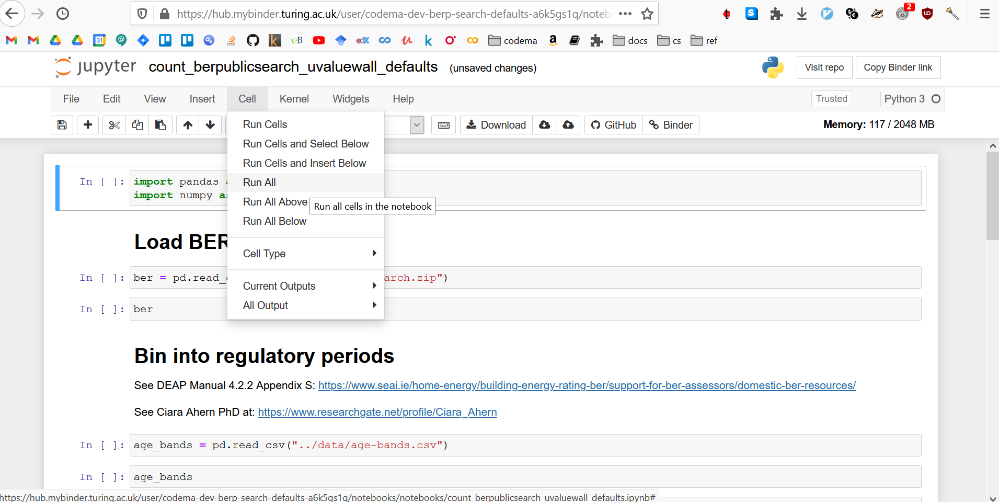

# berpublicsearch-heat-loss-parameter 
This notebook estimates the Heat Loss Parameter (HLP), as defined by the Sustainable Energy Authority of Ireland (SEAI), for all buildings in the BER Public search database.  

According to SEAI any dwelling with a HLP of less than 2 is suitable for a heat pump.  This notebook applies this cut-off to estimate heat pump viability of the latest BER stock.  See ['SEAI's Technical Assessment Process for Heat Pump System Grants'](https://www.seai.ie/publications/Technical_Advisor_Role.pdf) for more information.

To try it out for yourself click on the Binder Badge below

... and once the Notebook has been built select `Cell > Run All` from the dropdown menu

